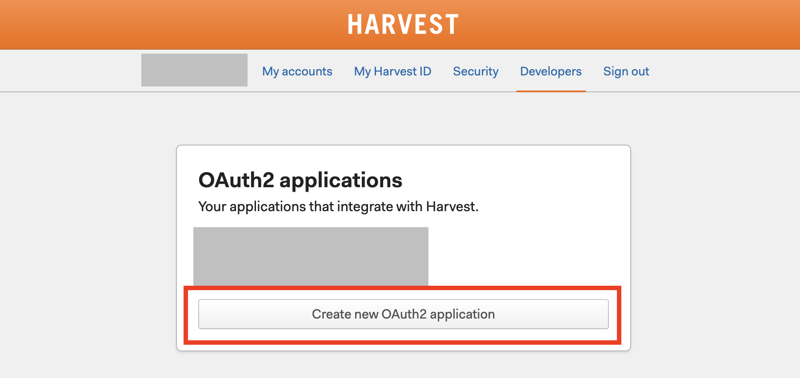
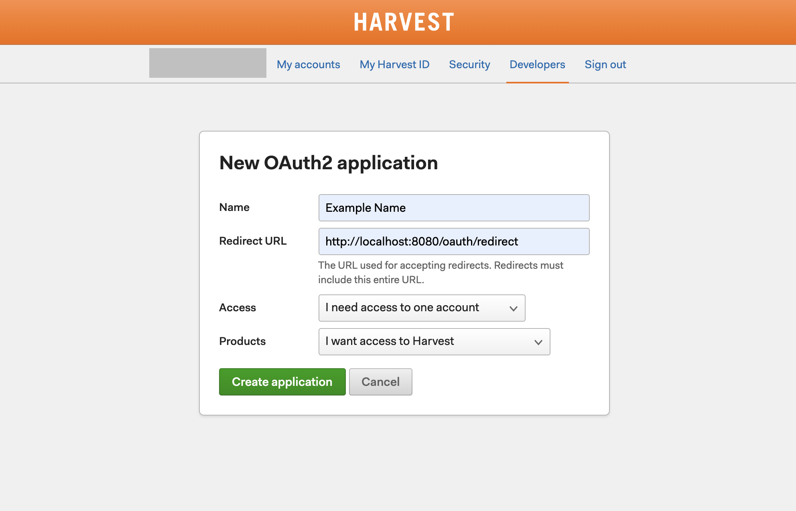
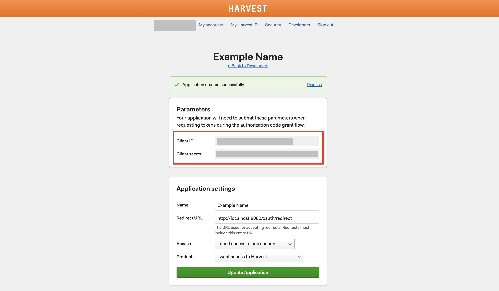

# Harvest Dashboard


[](https://github.com/vincentrohde/harvest-dashboard)
[](https://github.com/vincentrohde/harvest-dashboard)

A third-party Next.js client for the [Harvest API V2](https://help.getharvest.com/api-v2/), that helps you to manage the time tracking of your Harvest Account, while also giving you statistical feedback on how you spend your time.

**Disclaimer: This project is not affiliated with Harvest**


## Contents

1. [Getting Started](#getting-started)
2. [Run the Project](#run-the-project)
3. [Custom OAuth App](#custom-oauth-app)
4. [Production](#production)
5. [Docker Commands](#docker-commands)

## Getting Started

### Prerequisites

First, you will need a [Harvest account](https://www.getharvest.com) to fully use this project. The [free version](https://www.getharvest.com/pricing) will do fine. 

To run the project, 
you need to have **[Node.js](https://nodejs.org/en/)** and its package manager **[NPM](https://www.npmjs.com/)** installed on your environment. The project also supports [Docker 🐋](https://www.docker.com/)

### Installation

#### Clone repository

```
git clone https://github.com/vincentrohde/harvest-dashboard.git
cd ./harvest-dashboard
```

#### Run setup.sh

This will install the `node_modules` and add the required `.env` file.

```
./setup.sh
```

## Run the Project

Now that you have everything in place, you can start the dashboard.

### NPM (Recommended)

You can choose to run the dashboard using Node.js/ NPM. This

```
npm run dev
```

### Docker (Alternative)

If you have [Docker](https://www.docker.com/) installed, you can also run the dashboard using Docker.

You can start the dashboard via:

```
npm run dev:up
```

[Further down](#docker-commands) you will find an overview of all docker-related commands that are available in the project.

### Open in Browser

Now, the dashboard will be available via:

```
http://localhost:3000
```

## Custom OAuth App

If you want to use your own Harvest OAuth App, you can do so in the following way.

### Create your own Harvest OAuth App

First, you have to go to the [Developers section](https://id.getharvest.com/developers) of your account. Here you will have to use the `Create new OAuth2 application` button.



Now you will be directed to the setup page. On this page, you will have to set the `Redirect URL` field, which is the URL of your application.

#### Development

```
http://localhost:3000
```

#### Production

```
https://www.yourwebsite.com
```

Once everything is set, hit `Create application`.



Finally, you will arrive at the detail page of your OAuth App. The parameter `Client ID` will be required in your `.env` file.



### Update .env

When you have created your own OAuth App, you will have to update your `.env` file.

```
OAUTH_APP_ID={ the Client ID of your OAuth App }
```

## Production

If you want to host the dashboard there are two options available to you. 

### Using Next.js

This option is recommended if you use a hoster such as (Heroku, Cloudflare, etc.). They will allow you to automatically deploy on pushes to GitHub and most often host personal projects for free.

You are able to get a static version of the dashboard by running. 

```
npm run production
```

This will return you all production-ready files in the `./out` directory. This will be enough for most of these hosters, since they are able to specifically deal with Nexct.js projects.

#### Next Server

If you want to run a server on your own, you can then serve your static files using the server provided by Next.js. To do so, just run

```
npm run start
```

### Using Docker

If you are hosting on an actual server or virtual machine, the recommended option is to use Docker for the production version of your dahsboard. This will make deployment much easier, since the setup for you is only minimal (ie. installing Docker and NPM on your environment)

Once, Docker is installed on your environment you can run

```
npm run prod:up
```

Now a static version of your dashboard will be served, using an Nginx Server. It's available under

```
http://0.0.0.0 and http://localhost
```

## Docker Commands

The following commands are available to you, when using Docker.

| **Cmd**        | **Description**                                                                 |
|----------------|---------------------------------------------------------------------------------|
| dev:install    | Install the development container                                               |
| dev:up         | Run and install the development container                                       |
| dev:down       | Turn off the development container                                              |
| dev:uninstall  | Uninstall the development container                                             |
| prod:install   | Install the production container                                                |
| prod:up        | Run and install the production container. Files are served using an NGINX server |
| prod:down      | Turn off the production container                                               |
| prod:uninstall | Uninstall the production container                                              |


<a href="#harvest-dashboard">Back To Top</a>
