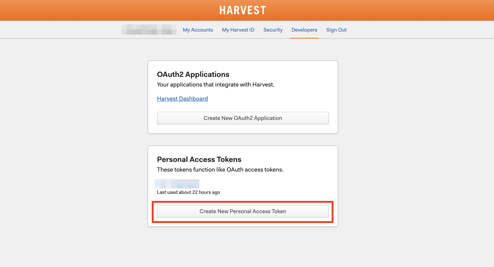
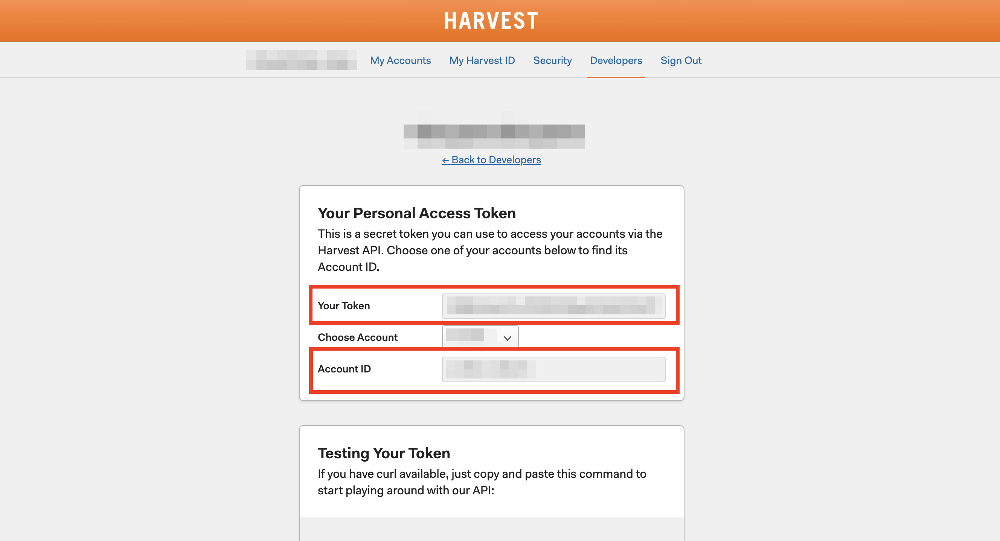

# Harvest Dashboard


[](https://github.com/vincentrohde/harvest-dashboard/actions/workflows/deploy.yml)
[](https://github.com/vincentrohde/harvest-dashboard/actions/workflows/codeql-analysis.yml)

[](https://github.com/vincentrohde/harvest-dashboard)
[](https://github.com/vincentrohde/harvest-dashboard)

A third-party React.js client for the [Harvest API V2](https://help.getharvest.com/api-v2/), that helps you to manage the time-trackings of your Harvest Account, while also giving you 
statistical feedback on how you spend your time.

## Contents

1. <a href="#getting-started">Getting Started</a>
    1. <a href="#prerequisites">Prerequisites</a>
    2. <a href="#installation">Installation</a>
    3. <a href="#access-to-harvest">Access to Harvest</a>
    4. <a href="#start-the-project">Start the Project</a>
2. <a href="#features">Features</a>
3. <a href="#development">Development</a>
4. <a href="#production">Production</a>

## Getting Started

### Prerequisites

First of all, you will need a [Harvest account](https://www.getharvest.com) to fully use this project. The [free version](https://www.getharvest.com/pricing) will do fine. To run the client, 
you need to have **Node.js** and its package manager **npm** installed on your environment.

### Installation

#### Clone repository

```
git clone https://github.com/vincentrohde/harvest-dashboard.git
cd ./harvest-dashboard
```

#### Install Server dependencies

```
cd ./server
npm install
```

#### Install Client dependencies

```
cd ./client
npm install
```

### Access to Harvest

#### Add an .env file

Start by creating your own `.env` file in the `/server` directory. You can use the `.env.example` file and just create a copy of it, with the filename `.env` like so:

````
cp ./server/.env.example ./server/.env
````

#### Harvest v2 Personal Access Token

If you have your [Harvest account](https://www.getharvest.com) ready. It's time to setup your own Personal Access Token. To do so, jump over to the [Developers section](https://id.getharvest.com/developers) of your account.

Under the tab **Personal Access Tokens** you will find the option **Create New Personal Access Token**



First of all start by setting the name for your token.


#### Setup Access to your Harvest Account

Now that you have your Personal Access Token. It's time to add its data to your `.env` file in `./server`. The fields marked in red (see below) are required in your `.env` file.



This should be your version of `./server/.env` :

```
HARVEST_API_URL=https://api.harvestapp.com
ACCESS_TOKEN={{ Insert "Your Token" here }}
ACCOUNT_ID={{ Insert "Account ID" here }}
READ_ONLY=false
```

### Start the Project

Now that you have everything in place you can start the servers.

#### Backend

To start the backend server, simply go to the `./server` directory and run the following command:

```
npm run start
```

The backend will be available under:

```
http://localhost:8080
```

#### Client

To start the client's dev-server, go to the `./client` directory and run:

```
npm run start
```

The dev-server will be available under:

```
http://localhost:3000
```

Now both servers are running and will automatically reload on file changes.

## Features

### Semantic UI

When implementing templates, the project makes use of [Semantic UI](https://semantic-ui.com/) through [semantic-ui-react](https://react.semantic-ui.com/).

### Components

#### DatePicker

With the `DatePicker` component you are able, to either select a certain date, a date range or a preset date range. On default, the `today` preset is selected.

**Presets**

| Preset | Output | Format |
|---|---|---|
| `today` | `[currentDay]` | `<'DD-MM-YYYY'>[]` |
| `one-week` | `[6 days ago, currentDay]` | `<'DD-MM-YYYY'>[]` |
| `one-month` | `[29 days ago, currentDay]` | `<'DD-MM-YYYY'>[]` |
| `one-year` | `[364 days ago, currentDay]` | `<'DD-MM-YYYY'>[]` |
| `all` | `1` | `number` |

Once a date value (either a single date, a date-range or 1) is set, the applications redux store (`store.filters.dateRange`) will be updated. When the `dateRange` property is updated, the application will request new time-entries from the backend.

#### EditForm

#### DataOverview

### Services

Services are classes that bundle various utility functions, that belong to a certain topic (ex. time-formatting). Server and client each have their own services.

Each service is written in the same pattern:

```
class ExampleService {
    ...
}

const exampleService = new ExampleService();
export default exampleService;
```


#### BackendService

Communication (create, read, update, delete) to the backend by the client using axios.

#### ApiService (Server)

Communication (create, read, update, delete) to the Harvest API by the server using axios.

#### TimeService

Time utility functions (ex. comparing or formatting dates) using `moment.js`.

#### ObjectService

Object utility functions (ex. sorting, comparing or updating objects).

## Development

### Branches

#### master
The `master` branch is used as the project's release branch. No development should happen here, since every `push` (newest commit) to `master` will generate a new `minor version release` of the project, which will also end up starting a new `deployment` workflow.

#### develop
The `develop` branch is used as a collection for changes that will end up as a new release. In general, new pushes should only come through merging `feature/` or `bug/` branches into `develop`. Each push results in a `patch` version bump, that is handled as a `pre-release`. For smaller issues it's fine to commit directly into `develop`.

#### feature/

A `feature/**` branch should be used for the development of a new feature. When the feature is ready, a `Pull Request` into `develop` should be opened.

#### bug/

A `bug/**` branch should be used when fixing bug-issues. When the bug is fixed, a `Pull Request` into `develop` should be opened.

### Types files

To prevent cluttering regular files with Typescript declarations (ex. interfaces, types, etc.). they should be moved into a separate file using the `.types` naming. The regular file will then import the `.types` file declarations.

**Example**

This is an example for a React component:

```
+ MyComponent
|   + MyComponent.tsx
|   + MyComponent.types.ts
```

```
// MyComponent.types.ts
export interface MyComponentProps {
    title: string;
}
```

```
// MyComponent.tsx

// Types
import { MyComponentProps } from './MyComponent.types';

const MyComponent = ({ title }: MyComponentProps) => <h2>{ title }</h2>;

export default MyComponent;
```

### Workflows

## Production

There are two ways you can deploy the project. In case you have forked the repository see the next section. If you didn't fork the repository, please follow the manual deployment guide.

### Automatic Deploy (fork)

If you have forked this repository you can automatically deploy the project using the `deployment` workflow.

#### Adding Secrets

To do this, you will need to add a few new GitHub secrets to your repo (the fork)

Go to your forked repository on Github and open the `Settings` tab. Now navigate to `Secrets` and click on `New Repository Secret`. Add the following secrets to your repository.

| Secret Name | Information |
|---|---|
| `SSH_KEY` | Your SSH key, with access to your server |
| `SSH_HOST` | Your server's IP address |
| `SSH_USER` | The server's user you log into with when using ssh |
| `SSH_LOCATION` | The directory on your server, where the repo should be deployed to (remote directory) |

#### Deploying

Now you can deploy either through pushing new commits to your `master` branch or through the `Actions` tab of your repository.

Here you will find a workflow called `Deployment`. If you click on `Run Workflow`, you will be able to deploy with any of your repository's branches.

### Manual Deploy (no fork)

If you have not created a fork of the repository, this is the guide to deploying the code. The guide assumes you have [Docker](https://www.docker.com/) and [Docker Compose](https://docs.docker.com/compose/install/) installed.

#### Copy to server

For the deploy you can either clone the project on your server (if you have git installed) or use ssh (scp or rsync) to copy it.

##### scp

If you have `rsync` installed you can skip copying with `scp`.

```
scp -r /path/to/local/copy user@your-server-ip:/path/to/remote/copy
```

##### rsync (alternative, recommended)

If you already copied using `scp`, you can skip this part.

```
rsync -avz -e 'ssh' /path/to/local/copy user@your-server-ip:/path/to/remote/copy
```

#### Start containers

The rest is fairly simple. Run the following command in the root of the project's directory.

```
docker-compose up -d
```

If you have [Make](https://www.gnu.org/software/make/manual/make.html) installed this command will also do the same.

```
make prod
```

#### Containers

##### api-server

This `Node.js` container will provide an `Express.js` api for your client server. It will be available under:

```
http://localhost:8080
```

##### dashboard

This container runs two services. First, it builds a production version (`/dist`) of the client (`build-service`). This version will then be served by `ngnix` (`nginx-server`). The container will be available under:

```
http://localhost
```

#### Stop containers

In case you want to stop the containers you can either run

```
docker-compose down
```

or

```
make down
```

<a href="#harvest-dashboard">Back To Top</a>
